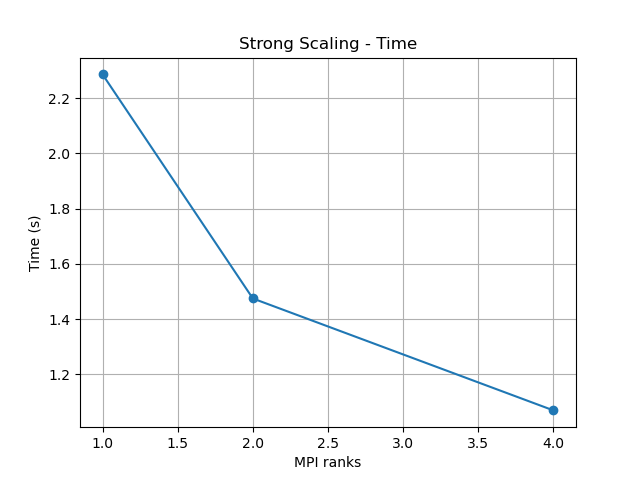
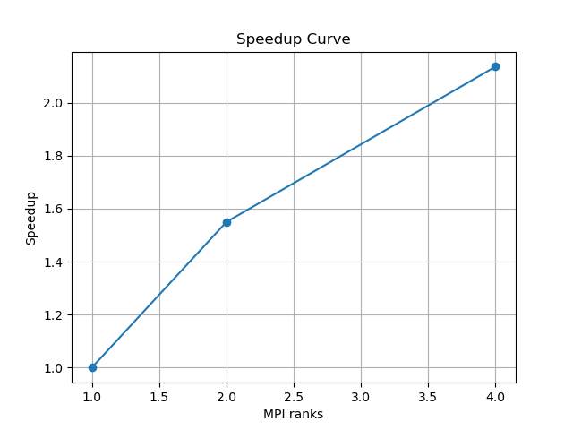

# Jacobi Parallel Solver – Results and Performance Analysis

## Overview

This project implements a parallel solver for the 2D Laplace equation using the Jacobi iterative method:

-∇²u = f(x,y) in Ω = (0,1)²  
with homogeneous Dirichlet boundary conditions.

The numerical solution is computed using a hybrid parallel approach:
- MPI for domain decomposition (row-wise block distribution)
- OpenMP for intra-process parallelization of the stencil computation

The forcing term is defined as:

f(x,y) = 8π² sin(2πx) sin(2πy)

with known analytical solution:

u(x,y) = sin(2πx) sin(2πy)

---

## Hardware Configuration

The experiments were conducted on the following system:

- CPU: Intel i3-1115G4 @ 3.00GHz
- 4 logical cores (2 physical cores with hyperthreading)
- RAM: 3.7 GB
- Single NUMA node

This configuration limits strong scaling beyond 4 MPI ranks due to full utilization of available logical cores.

---

## Experimental Setup

- Grid size: n = 128 × 128
- MPI ranks: 1, 2, 4
- OpenMP threads: 1 (fixed to isolate MPI scaling)
- Tolerance: 1e-6
- Maximum iterations: 10000

---

## Performance Results

The measured execution times are:

| MPI ranks | Time (s) |
|----------|----------|
| 1        | 2.28579  |
| 2        | 1.47493  |
| 4        | 1.06997  |

---

## Strong Scaling Analysis

The speedup is defined as:

S(p) = T(1) / T(p)

| MPI ranks | Speedup |
|----------|---------|
| 2        | 1.55    |
| 4        | 2.14    |

The parallel efficiency is:

E(p) = S(p) / p

| MPI ranks | Efficiency |
|----------|------------|
| 2        | 0.77       |
| 4        | 0.53       |

---

## Discussion

The results show good strong scaling behavior for the Jacobi solver.

### Observations:

- Execution time decreases consistently with increasing number of MPI processes.
- The scaling is sub-linear, which is expected for stencil-based iterative solvers.

### Main limiting factors:

1. **Communication overhead**
   - Each iteration requires ghost cell exchanges between neighboring MPI ranks.
   - This introduces latency that increases with the number of processes.

2. **Global synchronization**
   - The convergence check uses MPI_Allreduce, which introduces synchronization overhead.

3. **Memory bandwidth**
   - Jacobi iterations are memory-bound, limiting scalability.

---

## Plots

The following figures were generated using `plot.py`:

### Execution Time

### Speedup Curve

---

## OpenMP Contribution

OpenMP is used to parallelize the local stencil computation inside each MPI process using a collapsed loop over the 2D grid.

In this experiment, the number of OpenMP threads was fixed to 1 to isolate MPI scaling effects.

---

## Conclusions

- The solver correctly implements the Jacobi method for the 2D Poisson problem.
- MPI parallelization provides a significant performance improvement.
- The observed scaling behavior is consistent with theoretical expectations for communication-heavy iterative solvers.
- Efficiency decreases with increasing MPI ranks due to communication and synchronization overhead.

---

## Possible Improvements

Future work may include:

- Overlapping communication and computation (non-blocking optimization)
- Using more advanced solvers (e.g., Gauss-Seidel, multigrid)
- Improving convergence rate with preconditioning
- Reducing MPI synchronization cost

---

## Final Remark

The implementation demonstrates a correct and efficient hybrid MPI + OpenMP approach for solving elliptic PDEs, with expected strong scaling behavior on a shared-memory multicore system.
